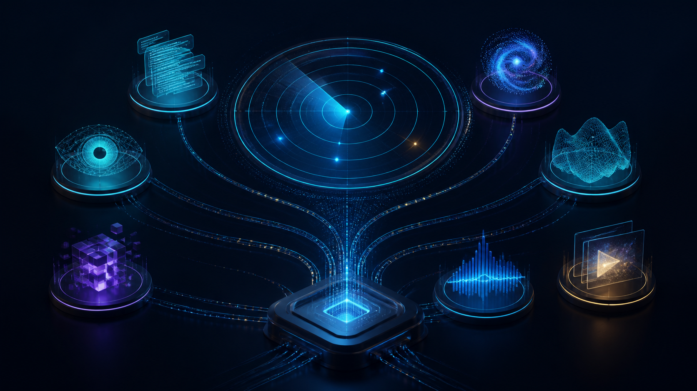

# August 2026 AI Model Launch Radar: What’s New on CometAPI

**Suggested URL:** /blog/august\-2026\-ai\-model\-launch\-radar

**SEO Description:** Review all 15 AI models CometAPI added in August 2026, verified against the official Changelog, with priority picks, exact model IDs, native or compatible endpoints, and current API pricing\.

**SEO Keywords:** August 2026 AI models, CometAPI Changelog, Qwen3\.8 Max, Qwen3\.8 Flash, Qwen3\.8 2\.4T A95B, Wan3\.0 API, GLM 5\.3 Flash API, Gemini 3\.7 Flash API, DeepSeek V4 Flash Vision, DeepSeek V4 Pro 0813, Grok 4\.6, Grok Imagine Image 2\.0, Grok Imagine Video 1\.5, Seedance 2\.5 API, MiniMax H3, FLUX 3

# August 2026 AI Model Launch Radar: What’s New in the CometAPI Catalog

**TL;DR:** The [CometAPI Changelog](https://www.cometapi.com/changelog/) records 15 new model IDs in August 2026 across text, multimodal, image, and video workloads\. Start with Seedance 2\.5 or Wan3\.0 for video, GLM 5\.3 Flash for cost\-sensitive multimodal work, and Gemini 3\.7 Flash for coding and long\-context tasks; then verify the live model page, endpoint, and price before deployment\.

## What New AI Models Did CometAPI Add in August 2026?

CometAPI’s August 2026 model roundup is useful because each model is available under one API key and one billing workflow, with stable catalog IDs, documented endpoints, and per\-model pricing\. Developers can switch a model ID without rebuilding the entire integration, while still using the native or compatible request format that best fits each provider\.

As of **September 1, 2026**, the [official CometAPI Changelog](https://www.cometapi.com/changelog/) is the source for August release timing and records 15 new model IDs across text reasoning, visual understanding, image generation, and video\. The [Models Catalog](https://www.cometapi.com/models/) and individual model pages remain the source for current availability and pricing\. The priority models to test first are Seedance 2\.5 for multimodal video, Wan3\.0 for production video workflows, GLM 5\.3 Flash for cost\-sensitive multimodal reasoning, and Gemini 3\.7 Flash for coding and long\-context work\.

## CometAPI August 2026 Model Release Summary

|Model / ID|Modality|Current CometAPI Price \(as of Sep 3, 2026\)|Recommended Endpoint|
|---|---|---|---|
|[Gemini 3\.7 Flash](https://www.cometapi.com/models/google/gemini-3-7-flash/) `gemini-3.7-flash`|Multimodal → text|$0\.60 input / $3\.00 output per 1M tokens|`POST /v1beta/models/{model}:generateContent`|
|[Grok 4\.6](https://www.cometapi.com/models/xai/grok-4-6/) `grok-4.6`|Text, image → text|$1\.60 input / $4\.80 output per 1M tokens|`POST /v1/chat/completions` `POST /v1/responses`|
|[GLM 5\.3](https://www.cometapi.com/models/zhipuai/glm-5-3/) `glm-5.3`|Text → text|$1\.12 input / $3\.528 output per 1M tokens|`POST /v1/chat/completions`|
|[DeepSeek V4 Flash Vision](https://www.cometapi.com/models/deepseek/deepseek-v4-flash-vision/) `deepseek-v4-flash-vision`|Text, image → text|$0\.352 input / $1\.056 output per 1M tokens|`POST /v1/chat/completions`|
|[Grok Imagine Image 2\.0](https://www.cometapi.com/models/xai/grok-imagine-image-2-0/) `grok-imagine-image-2.0`|Text, image → image|$0\.032 per request|`POST /v1/images/generations`|
|[GLM 5\.3 Flash](https://www.cometapi.com/models/zhipuai/glm-5-3-flash/) `glm-5.3-flash`|Text, image, video → text|$0\.06 input / $0\.20 output per 1M tokens|`POST /v1/chat/completions`|
|[Seedance 2\.5](https://www.cometapi.com/models/doubao/seedance-2-5/) `seedance-2-5`|Multimodal → video|From $0\.0824/s; detailed billing: $0\.103/s \(480p\), $0\.231/s \(720p\)|`POST /v1/videos`|
|[Qwen3\.8 Max](https://www.cometapi.com/models/aliyun/qwen3-8-max/) `qwen3.8-max`|Multimodal → text|$1\.60 input / $4\.80 output per 1M tokens|`POST /v1/chat/completions` `POST /v1/responses`|
|[MiniMax H3](https://www.cometapi.com/models/minimax/minimax-h3/) `minimax-h3`|Text, image, video, audio → video|From $0\.064/s; listed rates: $0\.08/s \(768p\), $0\.13/s \(2K\)|`POST /v1/videos` `GET /v1/videos/{task_id}`|
|[DeepSeek V4 Pro 0813](https://www.cometapi.com/models/deepseek/deepseek-v4/) `deepseek-v4-pro-0813`|Text → text|$0\.528 input / $1\.584 output / $0\.0176 cache read per 1M tokens; 2× in stated UTC windows|`POST /v1/chat/completions`|
|[FLUX 3](https://www.cometapi.com/models/flux/flux-3/) `flux-3`|Multimodal → video|$0\.136/s \(720p\); $0\.232/s \(1080p\)|`POST /v1/videos` `GET /v1/videos/{task_id}`|
|[Qwen3\.8 2\.4T A95B](https://www.cometapi.com/models/aliyun/qwen3-8-max/) `qwen3.8-2.4t-a95b`|Text → text|$1\.60 input / $4\.80 output per 1M tokens|`POST /v1/chat/completions`|
|[Grok Imagine Video 1\.5](https://www.cometapi.com/models/xai/grok-imagine-video/) `grok-imagine-video-1.5`|Text, image → video|Image input $0\.008; output $0\.064/s \(480p\), $0\.112/s \(720p\), $0\.20/s \(1080p\)|`POST /grok/v1/videos/generations` `GET /grok/v1/videos/{request_id}`|
|[Wan3\.0](https://www.cometapi.com/models/aliyun/wan3-0/) `wan3.0`|Text, image → video|From $0\.04/s; listed rates: $0\.05/s \(480p\), $0\.10/s \(720p\), $0\.20/s \(1080p\)|`POST /v1/videos`|
|[Qwen3\.8 Flash](https://www.cometapi.com/models/aliyun/qwen3-8-flash/) `qwen3.8-flash`|Multimodal → text|$0\.12 input / $0\.376001 output per 1M tokens|`POST /v1/chat/completions`|

This table highlights priority models from the 15 additions recorded in the [CometAPI August Changelog](https://www.cometapi.com/changelog/), including time\-limited discounted pricing where CometAPI states it\. Because benchmark claims come from different vendors and release dates, use the catalog for discovery and integration planning rather than as a universal head\-to\-head scorecard\.

Pricing\-only updates for `gpt-5.6-sol` and `minimax-m3`, plus service adjustments for existing DeepSeek models, are not counted as new releases\.

## 4 August Models I well recommend

The August catalog is broad, but four models stand out for different workloads\. The recommendations below focus on practical fit instead of repeating the pricing table; confirm the live rate and request format on each model page before production use\.

### Seedance 2\.5: Longer Multimodal Video

Because video pricing is billed per second and varies by resolution, preserve the snapshot date and link back to the live model page\. For [Seedance 2\.5](https://www.cometapi.com/models/doubao/seedance-2-5/), a 480p clip costs $0\.103 per second while a 720p clip costs $0\.231 per second—more than double—so budget against the resolution your workload actually uses\.

### Wan3\.0: Production Video at a Lower Entry Price

[Wan3\.0](https://www.cometapi.com/models/aliyun/wan3-0/) is now live for text\-to\-video and image\-to\-video workflows\. It is a practical option when teams need an asynchronous production endpoint, predictable per\-second billing, and room to compare speed, motion quality, and resolution against other video models\.

### GLM 5\.3 Flash: Low\-Cost Multimodal Reasoning

[GLM 5\.3 Flash](https://www.cometapi.com/models/zhipuai/glm-5-3-flash/) is the cost\-focused pick for high\-volume text and image understanding\. Test it for extraction, visual question answering, coding assistance, and agent steps where latency and cost matter more than maximum benchmark performance\.

### Kimi K3: Long\-Context Coding and Knowledge Work

[Kimi K3](https://www.cometapi.com/models/moonshotai/kimi-k3/) launched in July but remained one of the most relevant models to adopt during August\. Its one\-million\-token context and OpenAI\-compatible chat route make it useful for large repositories, research synthesis, and long\-running coding workflows\.

## Which New AI Model Should You Use by Use Case?

### Gemini 3\.7 Flash: Coding and Long\-Context Work

Published signals emphasize software engineering and knowledge work, but the useful production test is your own repository or document set\. Run a fixed prompt pack, record accepted\-task rate, latency, and billed tokens, then compare the result with the model you already use\.

### Video Models: Motion, Reference Fidelity, and Cost per Accepted Clip

For [Seedance 2\.5](https://www.cometapi.com/models/doubao/seedance-2-5/), Wan3\.0, and MiniMax H3, use the same prompt, duration, aspect ratio, and reference image\. Score motion consistency, prompt adherence, visual artifacts, generation time, and cost per clip that passes review\.

### Multimodal Models: Accuracy Before Maximum Context

For GLM 5\.3 Flash, DeepSeek V4 Flash Vision, and Gemini 3\.7 Flash, test screenshots, charts, PDFs, and mixed text\-image inputs\. A large context window matters only when the model retrieves the right evidence and produces a stable answer\.

**DeepSeek V4 Flash Vision****:** Use it for visual coding agents, chart analysis, screenshots, and browser\-automation inputs\. Benchmark it on your own mixed text\-image tasks and compare accuracy, latency, and billed tokens before production adoption\.

**Grok Imagine Image 2\.0****:** Use it for generation\-plus\-editing pipelines, multiple aspect ratios, product creative, and reference\-based iteration\. Budget from the quality and resolution your workload requires, not only the lowest starting price\.

## Coming Soon on CometAPI: Watchlist

As of September 3, 2026, this watchlist includes only models whose CometAPI pages are marked Coming Soon\. Treat their model IDs, routes, and pricing as provisional until the catalog confirms live production access\.

|Model|Model ID|Status|Decision|
|---|---|---|---|
|[Qwen\-Image\-3\.0](https://www.cometapi.com/models/aliyun/)|`qwen-image-3.0`|Coming Soon|Watchlist; do not plan production traffic yet\.|
|[Veo 4](https://www.cometapi.com/models/google/veo-4/)|`veo4`|Coming Soon|Wait for a confirmed live route and billing before production use\.|

## How Do You Call OpenAI\-Compatible and Native APIs with CometAPI?

CometAPI uses one API key and billing workflow, but it does not force every provider into one request shape\. Use the model page to choose the most suitable route: native Gemini content generation for Gemini, OpenAI\-compatible chat for many LLMs, image endpoints for image models, and the asynchronous video API for video models\. The short POST examples below show the route and model field only; see the [API documentation](https://apidoc.cometapi.com/) for complete parameters\.

- Text and multimodal LLMs Example: POST https://api\.cometapi\.com/v1beta/models/gemini\-3\.7\-flash:generateContent

- Image generation: POST https://api\.cometapi\.com/v1/images/generations

- Video generation: POST https://api\.cometapi\.com/v1/videos

The POST route changes with the modality\. Gemini supports native `/v1beta/models/{model}:generateContent` as well as compatible patterns; Grok Imagine Image 2\.0 uses `/v1/images/generations`; and Seedance 2\.5 uses `/v1/videos`, followed by task\-status polling\. Use the [Text API](https://apidoc.cometapi.com/api/text), [Image API](https://apidoc.cometapi.com/api/image), and [Video API](https://apidoc.cometapi.com/api/video) as the source of truth\.

## FAQ

### What are the best AI API aggregators for developers?

The best choice depends on whether you need only text LLMs or a broader text, image, audio, and video stack\. Evaluate each aggregator on live model IDs, endpoint compatibility, usage visibility, fallback support, billing transparency, and catalog freshness\. CometAPI is worth shortlisting when one key and one billing workflow across multiple modalities are priorities\.

### Which August 2026 models are actually live on CometAPI?

As of September 1, the August Changelog records 15 new model IDs\. The complete list, supported formats, and pricing notes are summarized in the table above\. Recheck the Models Catalog before deployment because availability, aliases, and prices can change\.

### Can I switch providers without changing my entire SDK?

Often, but not always\. Many text models support `/v1/chat/completions`, while Gemini can also use its native content\-generation route and media models use image, realtime, or video endpoints\. CometAPI keeps one key and billing workflow across these formats, so provider switching is simpler even when the request body is not identical\.

### How does video generation work?

Video generation is asynchronous\. Create the task, persist the returned task ID, then poll or receive a webhook until the task succeeds or fails\. Only after completion should the application retrieve and store the result\.

### How often should I recheck model IDs and prices?

Check before integration, before a production rollout, and before any large batch\. Automated systems should also log the exact model ID and price snapshot used for each cost estimate so later catalog changes do not rewrite the history of a deployment decision\.

## Bottom Line

CometAPI’s 15 August additions expand practical choices across coding, vision, image, and video while keeping one key and one billing workflow\. Start with Seedance 2\.5, Wan3\.0, GLM 5\.3 Flash, or Gemini 3\.7 Flash according to the workload, then promote a model only after fixed\-prompt tests measure quality, latency, reliability, and billed cost\.

