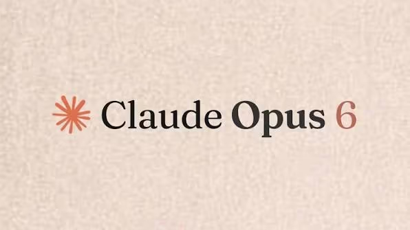

<!-- social-ops-fingerprint:150efb2d11de5751685c7388ed32e943f14b220668ee1232b95d38ab58b348cb -->
---
title: Claude Opus 6 Release Date: What Is Confirmed and How Developers Should Prepare
---
# Claude Opus 6 Release Date: What Is Confirmed and How Developers Should Prepare


*An evidence\-led preview of Anthropic's next possible Opus model, based on the current Claude catalog and the published Opus 5 baseline\.*



## TL;DR

**Claude Opus 6 **has not been officially announced or released\. Anthropic has not published a Claude Opus 6 model ID, release date, API endpoint, context window, price, system card, or benchmark report\. Treat `claude-opus-6` as an unverified placeholder, not as a production model\.

The current documented baseline is [**Claude Opus 5**](https://www.cometapi.com/models/anthropic/claude-opus-5/)\. Anthropic lists it for complex agentic coding and enterprise work\. Opus 5 has a 1\-million\-token context window, 128K maximum output, adaptive thinking enabled by default, and standard API pricing of **$5 per million input tokens and $25 per million output tokens**\. Anthropic's API\-only Fast mode is listed at $10/$50\.

The useful question is therefore not whether Opus 6 is already better\. It is how a future successor should be tested: accepted\-task rate, cost per successful result, latency, tool reliability, and human correction time\. Until Anthropic publishes primary documentation, Opus 5 is the defensible baseline\.

## Key Takeaways

- Anthropic's [current Claude model catalog](https://platform.claude.com/docs/en/about-claude/models/overview) does not document Claude Opus 6\.
- There is no confirmed Opus 6 release window\. Previous model timing is not a reliable schedule\.
- Opus 5 is available through the Claude API and major cloud platforms, with a 1M\-token context and 128K maximum output\.
- Opus 5 uses adaptive thinking by default; thinking tokens are billed as output tokens and count toward `max_tokens`\.
- Public Opus 5 benchmark results are a reference point, not Opus 6 evidence\. Vendor and independent evaluations use different harnesses\.
- Developers can prepare now by isolating model IDs, building a fixed evaluation set, and measuring cost per approved task\.

## Has Anthropic Announced Claude Opus 6?

No\. The official catalog currently describes [Claude Fable 5\.1](https://www.cometapi.com/models/anthropic/claude-fable-5-1/), Claude Opus 5, Claude Sonnet 5, and Claude Haiku 4\.5\. It identifies Opus 5 as the model for complex agentic coding and enterprise work; it does not list an Opus 6 entry, API identifier, or migration guide\.

That absence is more than a missing marketing page\. A production model normally has a documented identifier, capability limits, pricing, lifecycle status, and an availability surface\. Without those signals, claims about an Opus 6 launch date or specification are predictions\. A social post, reseller listing, search snippet, or model name in an SDK cannot establish an Anthropic release\.

The safest wording for a preview is therefore: **Claude Opus 6 is a possible future successor, but its existence, name, and release schedule remain unconfirmed\.**

## Claude Opus 6 Release Date

Anthropic has not announced a release date or launch window for Claude Opus 6\. Do not convert the release dates of Opus 4\.8 or Opus 5 into a forecast\. Anthropic can change naming, cadence, preview access, and regional rollout between generations\.

For a date to become publishable as confirmed, look for at least one primary signal from Anthropic: a news announcement, an entry in the official model catalog, an API model listing, or a model card/system card\. Until then, “coming soon” is a search phrase, not a product status\.

## The Confirmed Opus 5 Baseline

The table below separates the current product from the unknown successor\. Opus 6 cells are intentionally left unfilled rather than populated with estimates\.

|Specification|Claude Opus 5|Claude Opus 6|
|---|---|---|
|Status|Available|Not officially announced|
|API model ID|`claude-opus-5`|None documented|
|Context window|1M tokens|Unknown|
|Maximum output|128K tokens|Unknown|
|Inputs and outputs|Text and image input; text output|Unknown|
|Thinking|Adaptive, on by default|Unknown|
|Effort controls|Low, medium, high, xhigh, max|Unknown|
|Standard API price|$5/M input; $25/M output|Unknown|
|Fast mode|$10/M input; $50/M output, research preview on Claude API|Unknown|
|Parameter count|Not disclosed|Unknown|

Anthropic's [Opus 5 documentation](https://platform.claude.com/docs/en/about-claude/models/whats-new-opus-5) also documents mid\-conversation tool changes in beta, a default fallbacks mode in beta, and a 512\-token minimum cacheable prompt\. These are Opus 5 implementation details; they should not be assumed to carry over unchanged\.

## What Could Make an Opus 6 Upgrade Meaningful?

It is reasonable to define evaluation targets without presenting them as promised features\. A future Opus release would be materially useful if it improved the following outcomes\.

### More Reliable Long\-Horizon Agents

Opus 5 is aimed at work that spans many tools and verification cycles\. The next generation should be judged by whether it preserves the goal, recovers from failed calls, avoids repeating completed work, and stops when the result is actually ready\. Longer transcripts alone are not an improvement if the accepted\-task rate does not rise\.

### Better Repository\-Scale Coding

The relevant tests are multi\-file changes, root\-cause debugging, test execution, browser verification, and clean recovery after a failed implementation\. A useful successor should reduce unnecessary edits and unfinished stubs, not merely produce more code or a higher completion score on a narrow benchmark\.

### More Efficient Effort Scaling

Opus 5 offers low, medium, high, xhigh, and max effort\. Anthropic says additional effort produces more reliable gains than in earlier Opus models\. A successor could improve the quality\-per\-token curve: strong routine answers at low effort, predictable gains at higher effort, and better automatic allocation to difficult subproblems\. This is an evaluation hypothesis, not a confirmed Opus 6 feature\.

### Stronger Document and Visual Work

Anthropic's current Opus materials emphasize charts, diagrams, frontend visuals, spreadsheets, and slide decks\. A future model should be tested on calculation checking, conflicting evidence, editable artifacts, and visual verification across desktop and mobile layouts\. “Multimodal” should be measured by task completion and correction rate, not by input support alone\.

### Safety That Scales with Capability

More autonomous tool use increases the cost of a wrong action\. Any successor should be evaluated for prompt\-injection resistance, confirmation boundaries, sensitive\-data handling, refusal consistency, and escalation when evidence is incomplete\. Capability gains without dependable controls are not a production upgrade\.

## Claude Opus 5 Benchmark Baseline

There are no authentic Claude Opus 6 benchmark scores\. The following figures describe Opus 5 and are useful only as a baseline\. Anthropic's internal results and third\-party results should not be merged into one leaderboard\.

|Area|Evaluation|Opus 5 result or claim|Evidence type|
|---|---|---|---|
|Agentic coding|Frontier\-Bench v0\.1|More than 2x Opus 4\.8 at lower cost per task|Anthropic\-reported|
|Coding value|CursorBench 3\.2|Within 0\.5% of the cited Fable peak at max effort, at about half the cost per task|Anthropic\-reported|
|Novel reasoning|ARC\-AGI\-3 Public Demo|30\.16% at high effort|ARC Prize verified|
|Abstract reasoning|ARC\-AGI\-2 Semi\-Private|90\.4% at max effort|ARC Prize verified|
|Computer use|OSWorld 2\.0|Anthropic reports a result above its cited Fable best at just over one\-third the cost|Anthropic\-reported|
|Science|Internal life\-sciences evaluations|\+10\.2 percentage points in organic chemistry and \+7\.7 in protein\-function work versus Opus 4\.8|Anthropic internal|

The [ARC Prize results page](https://arcprize.org/results/anthropic-claude-opus-5) records 97\.5% on ARC\-AGI\-1 and 90\.4% on ARC\-AGI\-2 at max effort, while ARC\-AGI\-3 is reported at 30\.16% at high effort\. These benchmark versions measure different problems and should not be treated as one continuous scale\.

The lesson for an Opus 6 preview is simple: publish the benchmark version, reasoning level, tool permissions, sample size, and cost basis alongside the score\. A percentage without those conditions is not a reproducible claim\.

## Opus 5 Pricing and Real Cost

Anthropic lists Opus 5 at **$5 per million input tokens** and **$25 per million output tokens**\. Fast mode is a Claude API research preview at **$10/$50**\. Because adaptive thinking is enabled by default, thinking tokens are billed as output tokens and count toward the total `max_tokens` limit\.

For a simple standard\-mode request with 100,000 input tokens and 20,000 output tokens:

- Input: 0\.1 × $5 = $0\.50
- Output: 0\.02 × $25 = $0\.50
- Token total: **$1\.00**

That is a token estimate, not a guaranteed task cost\. Reasoning, retries, tool calls, cache behavior, and human review can add materially to the cost of an approved result\. Measure **cost per successful task**, not only cost per API call\.

## Current Alternatives While Opus 6 Is Unknown

If you need a model today, use the documented catalog rather than a guessed Opus 6 identifier\.

|Model|Status|Context|Listed input/output price|Intended fit in Anthropic's catalog|
|---|---|---|---|---|
|Claude Fable 5\.1|Available|1M|$10 / $50 per MTok|Demanding reasoning and long\-horizon agents|
|Claude Opus 5|Available|1M|$5 / $25 per MTok|Complex agentic coding and enterprise work|
|Claude Sonnet 5|Available|1M|$2 / $10 per MTok|Speed and intelligence balance|
|Claude Haiku 4\.5|Available|200K|$1 / $5 per MTok|Fast, lower\-cost workloads|
|Claude Opus 6|Unconfirmed|Unknown|Unknown|Cannot be selected responsibly|

These are catalog positions, not a universal quality ranking\. Choose by workload evaluations and operational constraints\.

## How to Prepare for Claude Opus 6

Do not hard\-code `claude-opus-6` in production\. Instead:

1. Keep the model ID in configuration, with an allow\-list of documented IDs\.
2. Save a representative evaluation set covering coding, document work, tool use, and refusal cases\.
3. Record accepted\-task rate, first\-token latency, end\-to\-end time, output tokens, retries, tool errors, and human correction time\.
4. Include cost per approved result, cache hits, failed attempts, and review labor in the comparison\.
5. Re\-run the same prompts, repository snapshots, tools, effort settings, and output limits when a successor is announced\.
6. Test migration behavior, especially thinking blocks, `max_tokens`, structured output parsing, tool schemas, and streaming\.

For teams that need one interface while evaluating several providers, a routing layer such as [CometAPI's Claude Opus 5 model endpoint](https://www.cometapi.com/models/anthropic/claude-opus-5/) can help keep the model ID configurable\. Verify supported parameters and limits in the [CometAPI API documentation](https://apidoc.cometapi.com/) before using the example in production; an abstraction layer does not remove provider\-specific behavior\.

### Minimal API Example

The following example uses the documented Opus 5 identifier\. It deliberately does not invent an Opus 6 endpoint\.

```Bash
curl https://api.cometapi.com/v1/messages \
  -H "Authorization: Bearer $COMETAPI_KEY" \
  -H "Content-Type: application/json" \
  -d '{
    "model": "claude-opus-5",
    "max_tokens": 1024,
    "messages": [
      {
        "role": "user",
        "content": "Review this implementation plan and identify hidden risks."
      }
    ]
  }'
```

Before deployment, confirm the route, streaming behavior, error format, and supported thinking parameters in the provider documentation\. Keep the model string in an environment\-specific configuration file\.

## What We Do Not Know Yet

|Unknown area|Responsible statement|
|---|---|
|Official name|Anthropic may not use the “Opus 6” label|
|Release date|No launch window has been published|
|Model ID|No `claude-opus-6` identifier is documented|
|Context and output|Larger limits cannot be assumed|
|Modalities|Audio, video, and richer output support are unknown|
|Reasoning controls|Effort and thinking behavior may change|
|Pricing|Input, output, caching, batch, and fast\-mode rates are unknown|
|Benchmarks|No Opus 6 score or system card exists|
|Availability|API, Claude, Code, and cloud rollout details are unknown|

Update this table only when Anthropic publishes primary documentation\. A model name appearing in a third\-party catalog is a lead for verification, not verification itself\.

## FAQ

### Is Claude Opus 6 available?

No\. Anthropic has not announced or documented a model named Claude Opus 6\. Claude Opus 5 is the current Opus model in the official catalog\.

### What is the Claude Opus 6 model ID?

There is no official model ID\. Do not assume that `claude-opus-6` is valid\. The documented Opus 5 identifier is `claude-opus-5`\.

### When will Claude Opus 6 be released?

There is no confirmed date or launch window\. Previous Opus release timing is not evidence of a future schedule\.

### Will Claude Opus 6 have a larger context window?

That is unknown\. Opus 5 already provides a 1M\-token context window, but Anthropic could prioritize reliability, latency, cost, or tool behavior instead of increasing the headline limit\.

### Will Claude Opus 6 be cheaper than Opus 5?

There is no pricing evidence\. Opus 5's published standard rate is $5/M input and $25/M output; that is a baseline for budgeting, not an Opus 6 forecast\.

### Can developers prepare before release?

Yes\. Establish an Opus 5 baseline, isolate model IDs in configuration, and track cost per accepted task\. When Anthropic announces a successor, use the same harness and failure cases to measure the actual change\.

## Conclusion

Claude Opus 6 remains a possible but unannounced successor, not a model developers can select today\. The reliable path is to use Opus 5 as the current baseline, treat every future specification as unknown until Anthropic documents it, and evaluate any successor against operational outcomes rather than a promotional scorecard\.

That approach keeps the article useful for search readers without turning a rumor\-shaped keyword into a fabricated product release\.
