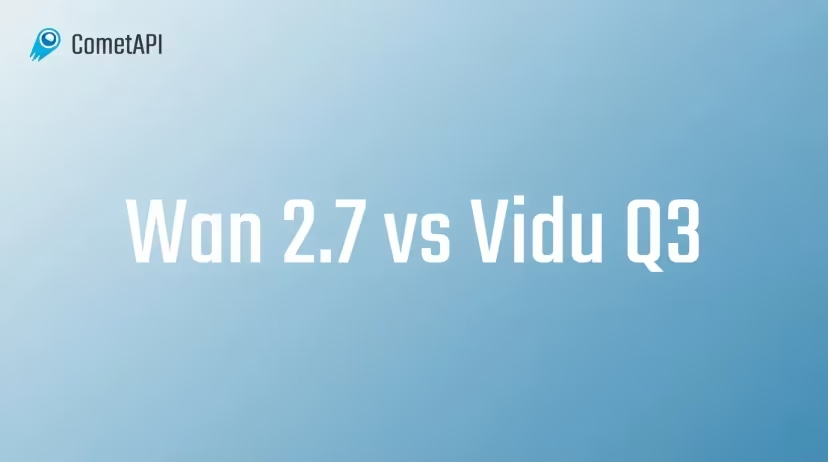

<!-- growth-fingerprint:467646c998299580926a096818be89a04dcdf50551edb4e37cb4a8bb71c08ad9 -->
---
title: What Is Gemini 3.8 Flash? Specs, Benchmarks, Pricing, and What Changed
---

# What Is Gemini 3\.8 Flash? Specs, Benchmarks, Pricing, and What Changed

## **Summary**

Gemini 3\.8 Flash is Google's production Flash upgrade for complex coding, agentic, and multimodal work\. It keeps the 1M\-token context class of Gemini 3\.7 Flash, while emphasizing deeper reasoning, more persistent tool use, and higher completion rates on long\-horizon tasks\.

## **Key takeaways**

• [1,048,576 input tokens and 65,536 output tokens](https://ai.google.dev/gemini-api/docs/models/gemini-3.8-flash), with text, image, video, audio, and PDF input support\.

• Google reports [73\.7% on DeepSWE v1\.1](https://deepmind.google/models/model-cards/gemini-3-8-flash/), up from 65\.3% for Gemini 3\.7 Flash in the same comparison\.

• The introductory standard rate is [$0\.75 per 1M input tokens and $3\.75 per 1M output tokens](https://ai.google.dev/gemini-api/docs/pricing) through December 31, 2026\.

• Upgrade when harder tasks benefit from retries, verification, and multi\-tool execution; retain 3\.7 for short, predictable, latency\-sensitive traffic\.

Google [released Gemini 3\.8 Flash on September 2, 2026](https://blog.google/innovation-and-ai/models-and-research/gemini-models/3-8-flash-and-3-8-flash-cyber/), three weeks after Gemini 3\.7 Flash\. Google positions it as its [most intelligent Flash model](https://ai.google.dev/gemini-api/docs/models/gemini-3.8-flash) for coding, agents, multimodal reasoning, and professional workflows\.

The release is not a simple context\-window upgrade\. [Built directly on Gemini 3\.7 Flash](https://deepmind.google/models/model-cards/gemini-3-8-flash/), the new model spends more computation on difficult tasks, performs additional reasoning steps, and uses tools more persistently\.

That design creates a practical tradeoff: stronger completion rates on long\-horizon work, but potentially more reasoning tokens and latency per task\. This guide focuses on that 3\.8\-specific delta—specifications, official benchmark results, pricing, and upgrade decisions—without repeating the general Gemini 3\.7 feature overview already covered on CometAPI\.

[*Official Google launch image \- Gemini 3\.8 Flash and 3\.8 Flash Cyber*](https://blog.google/innovation-and-ai/models-and-research/gemini-models/3-8-flash-and-3-8-flash-cyber/)

## What Is Gemini 3\.8 Flash?

[Gemini 3\.8 Flash](https://www.cometapi.com/models/google/gemini-3-8-flash/) is Google's production Flash model for long\-horizon software engineering, autonomous agents, multimodal analysis, and professional knowledge work\. Its distinguishing behavior is persistence: it can inspect intermediate results, invoke tools repeatedly, correct a failed step, and continue toward a larger objective\.

The model is generally available through the Gemini API and Google AI Studio\. Google's launch announcement also lists availability across the Gemini app, Gemini Enterprise Agent Platform, AI Mode, and Google Antigravity\.

### Gemini 3\.8 Flash Specifications

The technical envelope remains familiar to users of [Gemini 3\.7 Flash](https://www.cometapi.com/models/google/gemini-3-7-flash/)\. The most useful production specifications are summarized below; the low\-signal inventory of every unsupported generation mode has been removed\.

|[Official specification](https://ai.google.dev/gemini-api/docs/models/gemini-3.8-flash)|[Gemini 3\.8 Flash](https://www.cometapi.com/models/google/gemini-3-8-flash/)|
|---|---|
|Stable model ID|gemini\-3\.8\-flash|
|Release status|General availability|
|Maximum input|1,048,576 tokens|
|Maximum output|65,536 tokens|
|Input modalities|Text, image, video, audio, and PDF|
|Output modality|Text|
|Thinking levels|Low, medium, and high; medium by default|
|Core tools|Function calling, code execution, structured output, search grounding, URL context, and file search|
|Computer use|Supported in preview|
|Knowledge cutoff|March 2026 for some domains; some knowledge may remain limited to January 2025|

Google confirms a [1,048,576\-token input limit and 65,536\-token output limit](https://ai.google.dev/gemini-api/docs/models/gemini-3.8-flash)\. Because 3\.7 offers the same context envelope, context size alone is not a reason to migrate; the upgrade case rests on reasoning quality and task completion\.

## What's New in Gemini 3\.8 Flash?

Gemini 3\.8 Flash keeps the previous generation's context capacity, but changes how the model reasons, uses tools, and completes long workflows\. The main differences fall into four operating behaviors\.

### Deeper reasoning

Google says the model can [perform additional reasoning steps](https://blog.google/innovation-and-ai/models-and-research/gemini-models/3-8-flash-and-3-8-flash-cyber/) when a task becomes difficult\. A coding or research agent can inspect intermediate evidence, revise its approach, and verify the result instead of committing to the first plausible answer\.

### Agentic execution

Gemini 3\.8 Flash is designed to persist through multi\-step work involving search, code execution, function calls, error inspection, and recovery\. This makes the upgrade most relevant when success depends on completing an entire tool\-using workflow rather than producing one isolated response\.

### Thinking levels

The production model exposes [low, medium, and high thinking levels](https://ai.google.dev/gemini-api/docs/models/gemini-3.8-flash), with medium as the default\. Teams can use low reasoning for routine requests and reserve higher reasoning for tasks where completion quality matters more than latency or token use\.

### Multimodal workflows

The model can combine [text, images, video, audio, and PDFs](https://ai.google.dev/gemini-api/docs/models/gemini-3.8-flash) with function calling, code execution, search grounding, URL context, and structured output\. The improvement is therefore not a new media type, but more persistent reasoning across mixed evidence and tools\. The same launch also introduced Gemini 3\.8 Flash Cyber as a separate model for approved defensive\-security work\.

## What Changed From Gemini 3\.7 Flash?

For the earlier model's general capabilities and deployment context, see CometAPI's [Gemini 3\.7 Flash overview](https://www.cometapi.com/what-is-gemini-3-7-flash/)\. The 3\.8\-specific changes are narrower and more operational\.

### More persistent reasoning

Google says Gemini 3\.8 Flash can [perform additional reasoning steps](https://blog.google/innovation-and-ai/models-and-research/gemini-models/3-8-flash-and-3-8-flash-cyber/) on difficult tasks\. A repository agent can inspect dependencies, edit several files, run tests, diagnose a failure, revise the patch, and verify again instead of stopping after its first plausible answer\.

### More iterative tool use

The model is more willing to call tools repeatedly as evidence changes\. This matters for browser automation, research, coding, and document workflows where the correct next step depends on the previous tool result\.

### Higher task\-level quality, potentially higher token use

Google also warns that the model [may consume more tokens](https://blog.google/innovation-and-ai/models-and-research/gemini-models/3-8-flash-and-3-8-flash-cyber/), especially at higher thinking levels\. Gemini 3\.7 Flash therefore remains the efficiency\-first option for short, predictable traffic, while 3\.8 is better suited to tasks where retries and verification improve the probability of completion\.

### No context\-window expansion

Both generations retain the same 1M\-token input and 64K\-token output class\. The upgrade is behavioral rather than a simple increase in prompt capacity\.

## Gemini 3\.8 Flash vs Gemini 3\.7 Flash   \- comparison table   \- who should upgrade

The two generations share the same context class, so the upgrade decision should be based on task completion, tool persistence, latency, and token use rather than prompt capacity alone\.

|[Comparison dimension](https://deepmind.google/models/model-cards/gemini-3-8-flash/)|[Gemini 3\.8 Flash](https://www.cometapi.com/models/google/gemini-3-8-flash/)|[Gemini 3\.7 Flash](https://www.cometapi.com/models/google/gemini-3-7-flash/)|Decision impact|
|---|---|---|---|
|Positioning|Most intelligent production Flash model|Previous efficiency\-first Flash generation|3\.8 targets harder end\-to\-end work|
|Context capacity|1,048,576 input; 65,536 output tokens|Same 1M\-input / 64K\-output class|No capacity\-driven migration is required|
|DeepSWE v1\.1|73\.7%|65\.3%|3\.8 has the stronger coding\-agent result|
|Reasoning and tools|More reasoning steps and persistent multi\-tool execution|Better suited to short, predictable flows|3\.8 is preferable when retries and verification matter|
|Token and latency profile|Can use more tokens, especially at higher thinking levels|Generally the lighter option for routine traffic|Benchmark cost per completed task, not token price alone|
|Best\-fit workloads|Repository coding, research, multimodal analysis, multi\-tool agents|Classification, extraction, short drafting, stable automations|Route by workload instead of replacing 3\.7 everywhere|

### Who Should Upgrade?

Evaluate Gemini 3\.8 Flash now if you run repository\-scale coding, multi\-tool automation, professional research, multimodal analysis, or workflows that frequently escalate to a premium model\. Keep Gemini 3\.7 Flash for short, repetitive, latency\-sensitive tasks that already succeed reliably\.

A practical router can send difficult or failed tasks to 3\.8 while leaving efficiency\-first traffic on 3\.7\. Measure accepted\-task rate, end\-to\-end latency, tool\-call count, and total tokens before changing the default model\.

## Gemini 3\.8 Flash Official Benchmark Performance

Google's published evaluations show the clearest gains in long\-horizon coding, terminal work, professional agents, expert reasoning, and computer use\.

[*Google DeepMind's official Gemini 3\.8 Flash evaluation graphic*](https://deepmind.google/models/model-cards/gemini-3-8-flash/)

### Where Gemini 3\.8 Flash leads

On DeepSWE v1\.1, [73\.7% versus 65\.3%](https://deepmind.google/models/model-cards/gemini-3-8-flash/) is an 8\.4\-point generational gain and nearly matches Claude Opus 5 at 74\.0%\. On Terminal\-Bench 2\.1, 89\.4% slightly exceeds the 89\.1% result shown for Opus 5\. Vals Finance Agent v2 and the legal\-agent benchmark also favor 3\.8 in Google's comparison\.

### Where a premium model still leads

The result is not universal\. Claude Opus 5 reaches 51\.8% on Terminal\-Bench 4\.0 versus Gemini 3\.8 Flash at 19\.1%, and 75\.4% on OSWorld\-2\.0 versus 59\.0%\. The evidence supports a cost\-capability advantage for Gemini 3\.8 Flash, not a claim that it replaces every premium frontier model\.

### Benchmark verdict

Gemini 3\.8 Flash is strongest when the workload resembles long\-horizon coding or a specialized professional agent\. For difficult computer\-use environments and some terminal tasks, Claude Opus 5 remains the stronger choice\. Production teams should validate with accepted\-task rate, latency, and total token consumption rather than a single benchmark average\.

## Gemini 3\.8 Flash Pricing and Cost per Completed Task

Gemini 3\.8 Flash launched at the same introductory per\-token rate as 3\.7, but identical token pricing does not guarantee identical task cost because 3\.8 may reason longer\.

|[Google pricing mode](https://ai.google.dev/gemini-api/docs/pricing)|Input / 1M tokens|Output / 1M tokens|Cached input / 1M tokens|
|---|---|---|---|
|Standard through Dec\. 31, 2026|$0\.75|$3\.75|$0\.075|
|Standard from Jan\. 1, 2027|$1\.50|$7\.50|$0\.15|
|Batch through Dec\. 31, 2026|$0\.375|$1\.875|$0\.0375|
|Flex through Dec\. 31, 2026|$0\.375|$1\.875|$0\.0375|

The official pricing page states that [output pricing includes thinking tokens](https://ai.google.dev/gemini-api/docs/pricing)\. Evaluate cost per accepted task: extra reasoning can be economical when it prevents a failed run or a premium\-model fallback, but wasteful for classification, extraction, or short chat\.

|Route|Input / 1M tokens|Output / 1M tokens|
|---|---|---|
|Google introductory price|$0\.75|$3\.75|
|CometAPI listed price|$0\.60|$3\.00|
|Nominal difference|20% lower|20% lower|

[CometAPI's Gemini 3\.8 Flash page](https://www.cometapi.com/models/google/gemini-3-8-flash/) provides the current route price and availability\. Because provider prices can change, confirm the live model page before budgeting a production workload\.

## Gemini 3\.8 Flash vs Claude Opus 5 and Sonnet 5

|Decision dimension|[Gemini 3\.8 Flash](https://www.cometapi.com/models/google/gemini-3-8-flash/)|[Gemini 3\.7 Flash](https://www.cometapi.com/models/google/gemini-3-7-flash/)|[Claude Opus 5](https://www.cometapi.com/models/anthropic/claude-opus-5/)|[Claude Sonnet 5](https://www.cometapi.com/models/anthropic/claude-sonnet-5/)|
|---|---|---|---|---|
|Positioning|High\-intelligence Flash|Efficiency\-first Flash|Premium frontier reasoning|Balanced production agent|
|Context class|1M|1M|1M|1M|
|Long\-horizon coding|Near Opus 5 on DeepSWE|Strong but lower|Strongest overall range|Lower in Google's table|
|Computer use|Improved|Lower|Clear leader on OSWorld\-2\.0|Below Gemini 3\.8 in Google's table|
|Reasoning behavior|Persistent, more iterative|More efficiency\-oriented|Deep premium reasoning|Balanced quality and speed|
|Likely best fit|Cost\-sensitive complex agents|High\-volume predictable tasks|Hardest terminal and computer\-use work|General production agents|

The comparison result is workload\-dependent\. Choose 3\.8 for complex work that benefits from retries; retain 3\.7 for predictable high\-volume traffic; use Opus 5 when peak computer\-use or terminal capability justifies premium economics; test Sonnet 5 when a balanced Claude deployment is preferable\.

## Gemini 3\.8 Flash Use Cases: What Can It Do?

[Text, image, video, audio, and PDF inputs](https://ai.google.dev/gemini-api/docs/models/gemini-3.8-flash) can be combined with function calling, code execution, search grounding, URL context, file search, and structured output\. The 3\.8\-specific advantage is how persistently the model chains these capabilities across a complete workflow\.

### Coding

Provide source files, architecture notes, issue history, and test output in one working context\. The model can inspect dependencies, edit several files, run tests, diagnose failures, revise a patch, and verify the result\. Measure accepted fixes per run rather than judging only the first generated patch\.

### Agents

Use Gemini 3\.8 Flash for workflows that must plan, call multiple tools, inspect changed state, and recover from failed steps\. Production agents should enforce tool permissions, step limits, approval gates, and audit logs so persistence does not become uncontrolled action\.

### Research

Combine PDFs, policy files, public URLs, and internal evidence, then use [file search and grounded retrieval](https://ai.google.dev/gemini-api/docs/models/gemini-3.8-flash) to compare sources and return an auditable brief or structured record\. Retain source passages and require human review for legal, financial, or compliance decisions\.

### Multimodal workflows

A support or operations pipeline can combine screenshots, recorded calls, videos, PDFs, and text, extract the relevant evidence, classify the case, and prepare a structured handoff\. Confidence thresholds and escalation rules are essential when evidence is incomplete or conflicting\.

### Computer use

For browser\-based workflows, the model can interpret a page, choose the next action, invoke a tool, inspect the new state, and recover when a step fails\. Because [computer use remains in preview](https://ai.google.dev/gemini-api/docs/models/gemini-3.8-flash), keep approval gates around purchases, submissions, account changes, and other irreversible actions\.

## Limitations

More reasoning can increase token consumption and latency\. The [official model card](https://deepmind.google/models/model-cards/gemini-3-8-flash/) also notes hallucinations and occasional slowness or timeouts\. Its listed knowledge cutoff requires care: March 2026 applies to some domains, while some knowledge may remain limited to January 2025\.

The model produces text rather than native images or audio, and it does not support the Live API\. Google's automated safety evaluation also reports a [5\.4\-point regression in Multilingual Safety](https://deepmind.google/models/model-cards/gemini-3-8-flash/), where lower is better, which warrants extra multilingual testing before production deployment\.

## Frequently Asked Questions

### What is the Gemini 3\.8 Flash model ID?

The stable API model ID is gemini\-3\.8\-flash\.

### How large is the context window?

It supports up to 1,048,576 input tokens and 65,536 output tokens\.

### Is Gemini 3\.8 Flash better than Gemini 3\.7 Flash?

It is stronger on most of Google's published agent and professional benchmarks, but 3\.7 may remain more efficient for simple tasks\.

### Is Gemini 3\.8 Flash better than Claude Opus 5?

It nearly matches or slightly leads Opus 5 on some coding results in Google's comparison, while Opus 5 leads substantially on Terminal\-Bench 4\.0 and OSWorld\-2\.0\.

### Does it generate images or audio?

No\. It accepts multimodal inputs but returns text output\.

## Conclusion

Gemini 3\.8 Flash is a reasoning\-and\-persistence upgrade built on the 3\.7 foundation, not a larger\-context redesign\. Its strongest evidence is in long\-horizon coding and specialized agents; its clearest gaps remain harder terminal and computer\-use environments where Claude Opus 5 can lead\.

For production teams, the decisive metric is not price per token but cost per accepted task\. Test [Gemini 3\.8 Flash on CometAPI](https://www.cometapi.com/models/google/gemini-3-8-flash/) against 3\.7 and the relevant Claude model using your own traces before changing routing defaults\.

## SEO Metadata

**Meta title: **What Is Gemini 3\.8 Flash? Specs, Benchmarks \& Pricing

**Meta description: ****Explore Gemini 3\.8 Flash API pricing, specs, 1M\-token context, benchmarks, thinking levels, multimodal input, tools, limitations, and Gemini 3\.7 comparisons\.**

**Keywords: **Gemini 3\.8 Flash, Gemini 3\.8 Flash API, Gemini 3\.8, Gemini 3\.8 Flash benchmarks, Gemini 3\.8 Flash pricing, Gemini 3\.8 Flash vs Gemini 3\.7 Flash, Gemini Flash, Google Gemini API, Gemini coding model, AI agent model

**URL slug: **what\-is\-gemini\-3\-8\-flash
