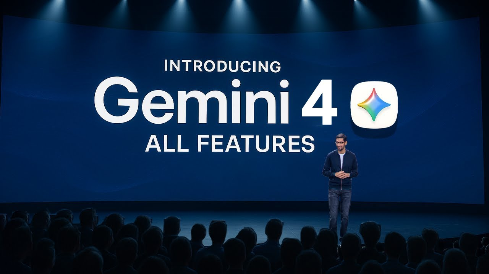

<!-- social-ops-fingerprint:61843723764e9f1e792ecc5e572ed600facfda6dde9cad662868475a23748f64 -->
---
title: Gemini 4 Is Reportedly in Training: What We Know and What Remains Unknown
---
# Gemini 4 Is Reportedly in Training: What We Know and What Remains Unknown

*A fact\-checked guide to the reported training signal, the missing specifications, and the tests that will matter if Google releases Gemini 4\.*

## TL;DR

[**Gemini 4**](https://ai.google.dev/gemini-api/docs/models)** is not a publicly released model\.** Google has not published a Gemini 4 model card, API identifier, release date, context window, pricing table, or benchmark report\. There is no verified way to use it in the Gemini API, Vertex AI, or CometAPI today\.

Secondary reports say Google has started a Gemini 4 pre\-training run and describe it as unusually ambitious\. That is a useful development signal, but it is not a product launch\. It does not confirm the final architecture, capabilities, model family, availability, or performance\.

Developers should therefore treat predicted features and benchmark scores as hypotheses\. The practical move is to benchmark currently available models now, keep model IDs configurable, and run the same evaluation suite only after Google publishes an official Gemini 4 identifier and documentation\.

## Key Takeaways

- Gemini 4 has no public API model ID, model card, price, or confirmed launch date\.
- Reports about pre\-training should not be converted into claims about a finished model\.
- No authentic Gemini 4 benchmark results have been published\.
- Reasoning, multimodality, coding, agents, context handling, and efficiency are useful areas to test, not confirmed Gemini 4 specifications\.
- Google\-reported results for earlier Gemini models can establish a baseline, but they cannot predict Gemini 4 performance\.
- CometAPI does not currently list a Gemini 4 model, so any integration example using `gemini-4` would be fictional\.

## Gemini 4 Status at a Glance

|Claim|Status|What the evidence supports|
|---|---|---|
|Google is working on Gemini 4|Reported|Secondary coverage says Google referenced a Gemini 4 pre\-training run|
|Gemini 4 is released|No|No public product page, model card, or release entry has been verified|
|Release date|Unknown|Google has not announced a date or launch window|
|API or Vertex AI model ID|Unknown|No public `gemini-4` identifier is documented|
|CometAPI availability|Not available|The current CometAPI catalog contains earlier Gemini generations but no Gemini 4 entry|
|Context window and output limit|Unknown|No official specification has been published|
|Modalities|Unknown|Text, image, audio, and video support have not been specified for Gemini 4|
|Pricing and rate limits|Unknown|No official price or quota information exists|
|Benchmark scores|Unknown|There are no published Gemini 4 evaluation results|
|Architecture and parameter count|Unknown|Google has not disclosed either|

This evidence boundary is the most important part of the story\. A training run can change, fail, split into several products, receive a different public name, or never ship in its reported form\. Until a model has an identifier, documentation, terms, and an access path, it is not a production dependency\.

## What Has Actually Been Reported?

The original [CometAPI Gemini 4 forecast](https://www.cometapi.com/gemini-4-expected-features-benchmarks-and-release/) discusses possible features, benchmark direction, and release timing\. After checking those claims against the current evidence, the defensible conclusion is narrower\.

A [secondary account of the Gemini 4 training reports](https://kie.ai/blog/what-is-gemini-4) says Google referred to its “most ambitious pre\-training run yet” and connected that run to Gemini 4\. The same account says Alphabet CEO Sundar Pichai later described the effort as “significantly larger\.” These statements are notable, but the available source is not a Google model announcement or system card\. They should remain attributed to secondary reporting until a primary transcript or Google publication can be linked directly\.

Even if the wording is accurate, “most ambitious pre\-training run” does not reveal parameter count, mixture\-of\-experts design, training data, context length, inference cost, or benchmark performance\. “Significantly larger” also does not tell developers whether the eventual model will be faster, cheaper, more accurate, or easier to operate\.

Google's current public materials are much clearer about products that already exist\. Its [July 2026 AI update](https://blog.google/innovation-and-ai/technology/ai/google-ai-updates-july-2026/) discusses releases including Gemini 3\.6 Flash, Gemini 3\.5 Flash\-Lite, and Gemini 3\.5 Flash Cyber\. It does not provide a Gemini 4 specification or release plan\.

## What We Still Do Not Know

The unknowns are not minor implementation details\. They are the information required to evaluate or deploy a model\.

### Release and availability

Google has not announced when Gemini 4 will launch, whether it will begin as a limited preview, or which regions and products would receive it first\. Historical release intervals are not reliable evidence for a future date\. Preview access, consumer availability, Gemini API access, and Vertex AI availability may also occur at different times\.

The clean availability test is simple: look for an official model name and identifier in the [Gemini API model documentation](https://ai.google.dev/gemini-api/docs/models), supported access details in the [Vertex AI model reference](https://cloud.google.com/vertex-ai/generative-ai/docs/learn/models), and a corresponding release\-note entry\. Until those appear, there is no public integration target\.

### Architecture and scale

There is no confirmed parameter count and no disclosed dense or mixture\-of\-experts architecture\. Training ambition can refer to compute, data, experiment scope, model size, or a combination of those factors\. Assigning a parameter estimate would turn an ambiguous phrase into a false specification\.

### Context and modalities

No official source has stated Gemini 4's context window, maximum output, or supported input and output types\. It may be reasonable to hope for stronger multimodal and long\-context behavior because those areas are central to the broader Gemini family, but that is a product expectation, not evidence about Gemini 4\.

### Pricing and quotas

There is no Gemini 4 input price, output price, cache rate, batch discount, free tier, rate limit, or enterprise quota\. Prices from earlier Gemini models are useful for today's budget, not a forecast for a future generation\.

### Benchmarks

There are no published Gemini 4 scores for coding, reasoning, agents, multimodal understanding, long\-context retrieval, or safety\. Any chart that assigns it a number today is estimating an unreleased system\.

## Expected Features or Evaluation Targets?

“Expected features” can sound like a leaked specification\. A safer and more useful framing is **what developers should test if Gemini 4 becomes available**\.

### Reasoning consistency

A stronger reasoning model should not merely solve a harder showcase problem\. It should remain accurate when prompts are paraphrased, cite the right evidence, acknowledge missing information, and preserve structured output across repeated runs\.

Test a set of real tasks several times\. Record the accepted\-answer rate, unsupported claims, schema failures, and variance between runs\. A small average gain can hide a costly increase in unpredictable failures\.

### Repository\-scale coding

For coding, measure complete outcomes rather than isolated snippets\. Give the model multi\-file bugs, migrations, failing tests, ambiguous requirements, and tool errors\. Score whether the patch works, whether unrelated code changed, how many retries were needed, and how much human correction remained\.

### Multimodal workflows

If a future Gemini 4 release supports several modalities, test whether it connects evidence across them\. A support workflow might include a device video, a photo of an indicator panel, a written symptom report, and a service manual\. The model should identify which evidence supports each conclusion and escalate when the inputs are insufficient\.

Input support alone is not multimodal reliability\. Compression, noisy audio, small text, conflicting inputs, and long media all belong in the evaluation set\.

### Effective context

A maximum context window describes capacity, not recall quality\. Place critical facts at the beginning, middle, and end of long inputs, add realistic distractors, and check whether the model retrieves and applies the right evidence\.

For coding agents, include cross\-file dependencies and deprecated wrappers\. For document analysis, include amendments that override earlier clauses\. The useful operational limit is the point at which task quality starts to fall, even if the advertised token limit is higher\.

### Agent and tool reliability

Agentic systems need more than correct tool selection\. They must pass valid arguments, handle partial failures, respect approval boundaries, avoid duplicate actions, and stop after a retry limit\.

Test timeouts, malformed JSON, conflicting tool results, missing permissions, and operations that require human approval\. Measure successful task completion and unnecessary calls, not only whether the model produced a plausible final paragraph\.

### Cost per accepted task

Headline token prices do not capture retries, reasoning tokens, extra tool calls, or human review\. Compare models with:

**total inference and tool cost / accepted outcomes**

Also record time to first token for interactive products and end\-to\-end completion time for automation\. A smaller model may remain the better default for routing, extraction, classification, or templated responses even after a more capable model launches\.

## What Current Benchmarks Can and Cannot Tell Us

Earlier Gemini results can provide a reproducible baseline, but they are not Gemini 4 evidence\. In its [Google I/O 2026 announcement summary](https://blog.google/innovation-and-ai/technology/ai/google-io-2026-all-our-announcements/), Google reported the following results for Gemini 3\.5 Flash:

|Evaluation|Gemini 3\.5 Flash result|Evidence type|
|---|---|---|
|Terminal\-Bench 2\.1|76\.2%|Google\-reported|
|GDPval\-AA|1,656 Elo|Google\-reported|
|MCP Atlas|83\.6%|Google\-reported|

These numbers describe Gemini 3\.5 Flash under Google's stated evaluation conditions\. They should not be extrapolated into a Gemini 4 score, combined with tests from different versions, or presented as an independent ranking\.

When Gemini 4 results eventually appear, check the benchmark version, tool access, reasoning setting, sample count, pass criteria, and test\-time compute\. Then reproduce the closest possible version on your own workload\. A leaderboard is useful for selecting candidates; it is not a deployment decision\.

## A Reproducible Evaluation Plan

Prepare the test before the model exists so that a launch announcement cannot change the scoring rules\.

1. Select 50 to 200 permissioned tasks that represent real production work\.
2. Define success criteria before running any candidate\.
3. Include ordinary cases, difficult edge cases, and known failure modes\.
4. Record quality, grounding, schema validity, tool accuracy, latency, retries, token use, and human correction time\.
5. Establish a baseline with the models available today\.
6. Keep model IDs and generation parameters in configuration\.
7. Add a future model only after its official ID, terms, pricing, and limits are documented\.
8. Run it first in offline evaluation, then shadow traffic, then a limited canary\.
9. Retain a rollback path until production behavior is stable\.

A compact scorecard can keep the comparison honest:

|Dimension|Example metric|
|---|---|
|Task quality|Accepted outputs / total cases|
|Grounding|Supported factual claims / all factual claims|
|Structure|Valid outputs / outputs requiring a schema|
|Tool use|Correct calls / attempted calls|
|Reliability|Successful tasks / started tasks|
|Latency|p50 and p95 end\-to\-end time|
|Cost|Total cost / accepted tasks|
|Stability|Score variance across repeated runs|

## Where CometAPI Fits

CometAPI can be useful for building a provider\-neutral evaluation harness against models that are currently listed\. One interface lets a team keep prompts, test cases, logging, and scoring stable while changing the configured model\.

That does **not** mean Gemini 4 is available through CometAPI\. As of this review, the catalog contains earlier Gemini model IDs but no `gemini-4` entry\. If an official Gemini 4 model is listed later, verify the exact provider mapping, supported modalities, parameters, price, limits, data handling, and error behavior before testing it\.

For workloads that depend on Google Cloud controls or newly released provider\-specific features, direct Gemini API or Vertex AI access may remain the better path\. A unified gateway reduces integration work; it does not make different provider surfaces identical\.

## What Signals Should Developers Watch?

Treat these as release evidence, in roughly this order:

1. A Google or Google DeepMind announcement naming the model\.
2. An official model card or technical report\.
3. A public model ID in the Gemini API or Vertex AI catalog\.
4. Published pricing, quotas, regional availability, and lifecycle status\.
5. Release notes that distinguish preview from general availability\.
6. Reproducible benchmarks with documented settings\.

Google's [Gemini API release notes](https://ai.google.dev/gemini-api/docs/changelog) and [Vertex AI generative AI release notes](https://cloud.google.com/vertex-ai/generative-ai/docs/release-notes) are better availability signals than a predicted month in a secondary article\.

## FAQ

### Is Gemini 4 released?

No\. As of September 2, 2026, no public Gemini 4 model card, model ID, pricing page, or access path has been verified\.

### Is Google training Gemini 4?

Secondary reports say Google referred to a Gemini 4 pre\-training run\. The available evidence should be described as a reported training signal, not as a product release or a confirmed specification\.

### When will Gemini 4 be released?

Google has not announced a release date or launch window\. Dates inferred from earlier Gemini releases are speculation\.

### What is the Gemini 4 API model ID?

There is no documented public model ID\. Do not assume that `gemini-4`, `gemini-4-pro`, or a similar string will be valid\.

### How much will Gemini 4 cost?

Pricing is unknown\. Google has not published input, output, caching, batch, or enterprise rates for Gemini 4\.

### What is the Gemini 4 context window?

It has not been announced\. Claims about a specific token limit are forecasts, not product documentation\.

### Are there official Gemini 4 benchmarks?

No\. Results for earlier Gemini models are baselines only and cannot be relabeled or projected as Gemini 4 performance\.

### Can I use Gemini 4 through CometAPI now?

No\. The CometAPI model catalog checked for this article does not currently list a Gemini 4 identifier\. Developers can use available models to prepare an evaluation baseline and test Gemini 4 only if an official listing appears later\.

## Conclusion

The responsible Gemini 4 story is short on specifications because the specifications do not yet exist publicly\. There is a reported training signal, but no released model, confirmed date, API ID, price, context limit, or benchmark result\.

That does not make preparation pointless\. It makes preparation more disciplined\. Build the evaluation set now, measure today's baseline, keep the integration configurable, and let a future Gemini 4 release earn its place through reproducible results\. Until Google publishes primary documentation, every more specific claim should remain clearly labeled as speculation\.
